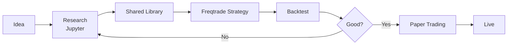

# 🚀 Stoic Citadel - Quick Start Guide

**Версия**: 2.0
**Последнее обновление**: 2025-11-27

---

## ⚡ Быстрый старт (5 минут)

### 1. Клонирование и setup

```bash
# Клонирование репозитория
git clone https://github.com/kandibobe/hft-algotrade-bot.git
cd hft-algotrade-bot

# Интерактивная настройка
make setup
```

### 2. Первый бэктест

```bash
# Запуск быстрого бэктеста
make backtest STRATEGY=StoicCitadelV2 TIMERANGE=20240101-20240130

# Просмотр результатов
cat user_data/backtest_results/*.json
```

### 3. Запуск paper trading

```bash
# Старт dry-run режима
make trade-dry

# Dashboard
open http://localhost:3000

# Логи в реальном времени
make logs SERVICE=freqtrade
```

---

## 📚 Полные руководства

- **📖 [README.md](README.md)** - Основная документация
- **🧪 [docs/TESTING_GUIDE.md](docs/TESTING_GUIDE.md)** - Как тестировать
- **📊 [docs/STRATEGY_DEVELOPMENT_GUIDE.md](docs/STRATEGY_DEVELOPMENT_GUIDE.md)** - Как менять стратегии
- **🏗️ [ARCHITECTURE_ANALYSIS.md](ARCHITECTURE_ANALYSIS.md)** - Архитектура и улучшения

---

## 🎯 Основные команды

### Development

```bash
make test          # Запуск тестов
make lint          # Проверка качества кода
make format        # Форматирование кода
```

### Trading

```bash
make trade-dry     # Paper trading
make trade-live    # ⚠️ LIVE trading
make backtest      # Бэктест стратегии
make research      # Jupyter Lab
```

### Monitoring

```bash
make monitoring    # Запуск Grafana + Prometheus
make logs          # Просмотр логов
make status        # Статус сервисов
```

---

## 🔧 Как изменить стратегию

### Вариант 1: Изменить существующую

```bash
# 1. Открыть стратегию
nano user_data/strategies/StoicCitadelV2.py

# 2. Изменить параметры (например, RSI порог)
# Было: (dataframe['rsi'] < 35)
# Стало: (dataframe['rsi'] < 25)

# 3. Протестировать
make backtest STRATEGY=StoicCitadelV2

# 4. Применить
make restart
```

### Вариант 2: Создать новую

```bash
# 1. Скопировать шаблон
cp user_data/strategies/StoicCitadelV2.py \
   user_data/strategies/MyStrategy.py

# 2. Изменить класс
class MyStrategy(IStrategy):
    # Ваша логика

# 3. Тестировать
make backtest STRATEGY=MyStrategy

# 4. Подключить в docker-compose.yml
nano docker-compose.yml
# Изменить --strategy MyStrategy
```

**Подробно**: [docs/STRATEGY_DEVELOPMENT_GUIDE.md](docs/STRATEGY_DEVELOPMENT_GUIDE.md)

---

## 🧪 Как тестировать

### Quick Test (локально)

```bash
# Unit тесты
pytest tests/test_strategies/test_my_strategy.py -v

# Бэктест 30 дней
make backtest STRATEGY=MyStrategy TIMERANGE=20240101-20240130
```

### Full Test (перед продом)

```bash
# 1. Полный бэктест 90+ дней
docker-compose run --rm freqtrade backtesting \
  --strategy MyStrategy \
  --timerange 20240101- \
  --enable-protections

# 2. Walk-forward валидация
python scripts/walk_forward.py \
  --strategy MyStrategy \
  --train-period 60 \
  --test-period 15

# 3. Paper trading минимум 2 недели
make trade-dry

# 4. Мониторинг и сравнение с бэктестом
```

**Подробно**: [docs/TESTING_GUIDE.md](docs/TESTING_GUIDE.md)

---

## 🗂️ Структура проекта

```
stoic-citadel/
├── src/                        # ⭐ НОВОЕ: Shared library
│   ├── signals/                # Логика сигналов (research + production)
│   └── risk/                   # Risk management (correlation, drawdown)
│
├── user_data/
│   ├── strategies/             # Ваши стратегии
│   │   ├── StoicCitadelV2.py   # ⭐ Улучшенная стратегия
│   │   └── YourStrategy.py
│   └── config/
│       ├── config_production_fixed.json  # ⭐ С PostgreSQL
│       └── config_dryrun.json
│
├── tests/                      # Тесты
│   ├── test_strategies/
│   └── test_signals/           # ⭐ Тесты shared library
│
├── docs/                       # ⭐ Документация
│   ├── TESTING_GUIDE.md
│   └── STRATEGY_DEVELOPMENT_GUIDE.md
│
├── Makefile                    # Команды
├── docker-compose.yml          # Инфраструктура
└── README.md                   # Основная документация
```

---

## 🔄 Типичные Workflow

### Workflow 1: Разработка новой стратегии



```bash
# 1. Research в Jupyter
make research
# Разработка и тестирование идеи

# 2. Создание shared function
nano src/signals/my_signals.py

# 3. Freqtrade strategy
nano user_data/strategies/MyStrategy.py

# 4. Тестирование
make test
make backtest STRATEGY=MyStrategy

# 5. Paper trading
make trade-dry

# 6. Live (после 2+ недель)
make trade-live
```

### Workflow 2: Модификация параметров

```bash
# 1. Изменить параметры
nano user_data/strategies/StoicCitadelV2.py

# 2. Quick test
make backtest STRATEGY=StoicCitadelV2 TIMERANGE=20240101-20240107

# 3. Если результат хороший - full test
make backtest STRATEGY=StoicCitadelV2 TIMERANGE=20240101-

# 4. Применить
make restart
```

---

## 🐛 Troubleshooting

### Проблема: Бот не открывает сделки

```bash
# 1. Проверить логи
make logs SERVICE=freqtrade

# 2. Проверить whitelist
docker-compose run --rm freqtrade list-pairs

# 3. Проверить наличие данных
ls -lh user_data/data/binance/

# 4. Проверить индикаторы
pytest tests/test_strategies/ -v
```

### Проблема: Тесты не проходят

```bash
# Подробный вывод
pytest tests/ -vv

# Конкретный тест
pytest tests/test_strategies/test_my_strategy.py::test_entry_signals -vv

# Покрытие
make test-coverage
open htmlcov/index.html
```

### Проблема: PostgreSQL не подключается

```bash
# 1. Проверить статус
docker-compose ps postgres

# 2. Проверить логи
docker-compose logs postgres

# 3. Проверить конфиг
grep "db_url" user_data/config/config_production_fixed.json

# 4. Тест подключения
docker-compose exec postgres psql -U stoic_trader -d trading_analytics
```

---

## ⚙️ Конфигурация

### Основные файлы

```bash
# Dry-run конфиг (для тестов)
user_data/config/config_dryrun.json

# Production конфиг (для live)
user_data/config/config_production_fixed.json  # ⭐ С PostgreSQL

# Environment variables
.env  # Создается при setup
```

### Критические параметры

```json
{
  "max_open_trades": 3,              // Макс открытых позиций
  "stake_amount": "unlimited",       // Размер позиции
  "tradable_balance_ratio": 0.99,    // Используемый капитал
  "stoploss": -0.05,                 // Hard stop -5%
  "dry_run": true,                   // false для live
  "db_url": "postgresql://..."       // ⭐ PostgreSQL
}
```

---

## 📊 Мониторинг

### Dashboards

```bash
# Запуск мониторинга
make monitoring

# Доступ
open http://localhost:3001  # Grafana (admin/admin)
open http://localhost:9090  # Prometheus
open http://localhost:3000  # FreqUI (trading dashboard)
```

### Ключевые метрики

- **Win Rate**: Должен быть > 50%
- **Profit Factor**: Должен быть > 1.5
- **Max Drawdown**: Должен быть < 15%
- **Sharpe Ratio**: Должен быть > 0.5

---

## 🔐 Security Checklist

Перед live trading:

- [ ] API keys в environment variables (не hardcode)
- [ ] Telegram notifications настроены
- [ ] Stoploss протестирован
- [ ] Max drawdown установлен
- [ ] Circuit breaker активен
- [ ] PostgreSQL backup настроен
- [ ] Monitoring работает
- [ ] Paper trading > 2 недель
- [ ] Whitelist проверен
- [ ] API rate limits настроены

---

## 📞 Поддержка

### Документация
- [README.md](README.md) - Полная документация
- [ARCHITECTURE_ANALYSIS.md](ARCHITECTURE_ANALYSIS.md) - Архитектура
- [docs/TESTING_GUIDE.md](docs/TESTING_GUIDE.md) - Тестирование
- [docs/STRATEGY_DEVELOPMENT_GUIDE.md](docs/STRATEGY_DEVELOPMENT_GUIDE.md) - Разработка

### Команды

```bash
# Помощь по Makefile
make help

# Помощь по Freqtrade
docker-compose run --rm freqtrade --help

# Помощь по конкретной команде
docker-compose run --rm freqtrade backtesting --help
```

---

## 🎯 Следующие шаги

После Quick Start:

1. **Изучите документацию**:
   - [docs/TESTING_GUIDE.md](docs/TESTING_GUIDE.md)
   - [docs/STRATEGY_DEVELOPMENT_GUIDE.md](docs/STRATEGY_DEVELOPMENT_GUIDE.md)

2. **Запустите полный бэктест**:
   ```bash
   make backtest STRATEGY=StoicCitadelV2
   ```

3. **Настройте monitoring**:
   ```bash
   make monitoring
   ```

4. **Создайте свою стратегию**:
   - Следуйте [Strategy Development Guide](docs/STRATEGY_DEVELOPMENT_GUIDE.md)

5. **Paper trading минимум 2 недели**

6. **Live trading с малым капиталом**

---

**Помните**: "Better to spend 2 weeks testing than lose money in 1 day."

🏛️ **Stoic Citadel** - Trade with wisdom, not emotion.
