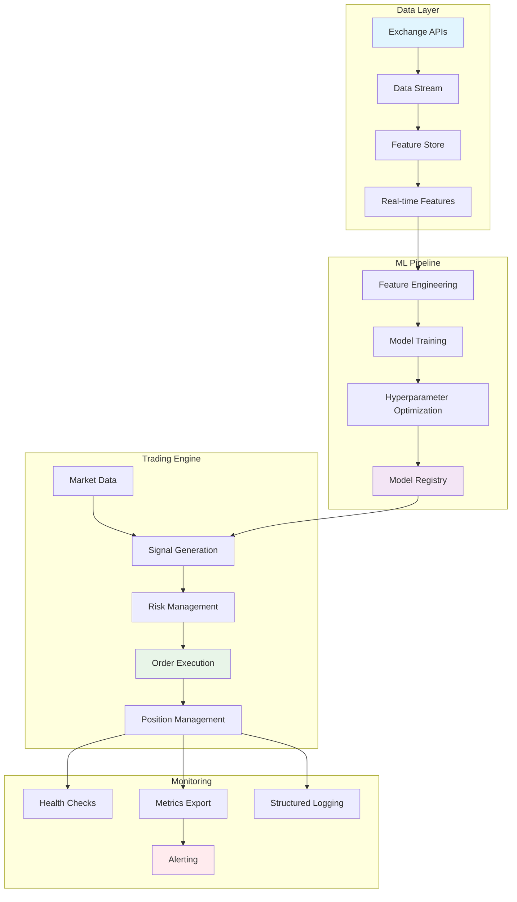

# 🏛️ Stoic Citadel - Professional Algorithmic Trading System

[](https://www.python.org/downloads/)
[](https://www.freqtrade.io/)
[](LICENSE)
[](https://github.com/psf/black)
[](https://docs.pytest.org/)

> *"The wise man accepts losses with equanimity."* — Marcus Aurelius

**Stoic Citadel** is a production-ready algorithmic trading platform built on Freqtrade, featuring advanced machine learning, risk management, and professional-grade infrastructure.

## 📋 Table of Contents
- [✨ Features](#-features)
- [🏗️ Architecture](#️-architecture)
- [🚀 Quick Start](#-quick-start)
- [📁 Project Structure](#-project-structure)
- [📊 System Architecture](#-system-architecture)
- [🛠️ Development](#️-development)
- [🧪 Testing](#-testing)
- [📈 Production Deployment](#-production-deployment)
- [📄 License](#-license)

## ✨ Features

### 🎯 **Trading Engine**
- **Ensemble ML Strategies** - Multiple ML models voting for robust signals
- **Regime-Aware Trading** - Adapts to bull/bear/sideways markets
- **Smart Order Execution** - Maker/taker optimization with fee savings
- **Circuit Breaker Protection** - Automatic risk protection against catastrophic losses
- **Dynamic Position Sizing** - ATR-based sizing with portfolio risk management

### 🤖 **MLOps Pipeline**
- **Feature Engineering** - 50+ technical indicators with proper stationarity
- **Triple Barrier Labeling** - ML labels accounting for fees and holding periods
- **Hyperparameter Optimization** - Optuna-based optimization with parallel execution
- **Model Registry** - Versioned model management with production promotion
- **Walk-Forward Validation** - Robust out-of-sample testing with sliding windows

### 🛡️ **Production Infrastructure**
- **Health Monitoring** - Kubernetes-ready health checks with FastAPI
- **Structured Logging** - JSON logs for ELK stack integration
- **Metrics & Dashboards** - Prometheus metrics with Grafana visualization
- **Containerized Deployment** - Docker Compose for all services
- **CI/CD Ready** - GitHub Actions workflows for automated testing

### 📊 **Validation & Testing**
- **190+ Unit Tests** - Comprehensive test coverage
- **Property-Based Testing** - Hypothesis for robust validation
- **Load Testing** - Locust-based performance testing
- **Integration Testing** - End-to-end trading flow validation

## 🏗️ Architecture



## 🚀 Quick Start

### Prerequisites
- Docker & Docker Compose
- Python 3.11+ (for development)
- Git

### 1. Clone & Setup

```bash
# Clone repository
git clone https://github.com/kandibobe/mft-algotrade-bot.git
cd mft-algotrade-bot

# Copy environment template
cp .env.example .env

# Edit with your credentials
nano .env  # Add exchange API keys
```

### 2. Start Services

```bash
# Using Makefile (recommended)
make setup      # Install dependencies
make start      # Start all services

# Or using Docker Compose directly
docker-compose up -d
```

### 3. Access Dashboards

- **FreqUI Trading Interface**: http://localhost:3000
- **Jupyter Lab (Research)**: http://localhost:8888
- **Grafana Metrics**: http://localhost:3001
- **Prometheus**: http://localhost:9090

### 4. Run Your First Backtest

```bash
# Using Makefile
make backtest

# Or directly
docker-compose exec freqtrade freqtrade backtesting --config user_data/config/config_backtest.json --strategy StoicEnsembleStrategyV4
```

## 📁 Project Structure

```
mft-algotrade-bot/
├── 📁 src/                          # Source code
│   ├── 📁 config/                   # Configuration management
│   ├── 📁 data/                     # Data loading & processing
│   ├── 📁 ml/                       # Machine learning pipeline
│   │   ├── 📁 training/             # Model training & optimization
│   │   └── feature_store.py         # Feature storage & retrieval
│   ├── 📁 monitoring/               # Health checks & metrics
│   ├── 📁 order_manager/            # Order execution system
│   ├── 📁 risk/                     # Risk management
│   ├── 📁 strategies/               # Trading strategies
│   ├── 📁 utils/                    # Utilities & helpers
│   └── 📁 websocket/                # WebSocket connections
├── 📁 scripts/                      # Utility scripts
│   ├── backtest.py                  # Backtesting utilities
│   ├── preflight_check.py           # Environment validation
│   ├── train_models.py              # ML model training
│   └── walk_forward_analysis.py     # Walk-forward validation
├── 📁 tests/                        # Test suite (190+ tests)
├── 📁 user_data/                    # Freqtrade user data
│   ├── 📁 config/                   # Trading configurations
│   ├── 📁 strategies/               # Trading strategies
│   ├── 📁 models/                   # Trained ML models
│   └── 📁 data/                     # Historical market data
├── 📁 docs/                         # Documentation
├── 📁 examples/                     # Usage examples
├── 📁 notebooks/                    # Jupyter notebooks
├── 📁 reports/                      # Analysis reports
├── 📁 monitoring/                   # Monitoring configuration
├── 📁 mcp_servers/                  # MCP servers for external tools
├── 📄 .env.example                  # Environment template
├── 📄 .gitignore                    # Git ignore rules
├── 📄 docker-compose.yml            # Production services
├── 📄 Dockerfile                    # Application container
├── 📄 Makefile                      # Development commands
├── 📄 pyproject.toml                # Python project configuration
├── 📄 requirements.txt              # Production dependencies
├── 📄 requirements-dev.txt          # Development dependencies
└── 📄 README.md                     # This file
```

## 📊 System Architecture

### Data Flow
1. **Data Ingestion**: Real-time market data from exchanges via WebSocket
2. **Feature Engineering**: Calculate technical indicators and ML features
3. **Signal Generation**: ML models predict trading signals
4. **Risk Assessment**: Position sizing and risk checks
5. **Order Execution**: Smart order routing with fee optimization
6. **Monitoring**: Real-time performance tracking and alerts

### ML Pipeline
- **Training**: Walk-forward cross-validation to prevent look-ahead bias
- **Validation**: Triple barrier labeling with realistic trading costs
- **Deployment**: Model registry with version control and A/B testing
- **Monitoring**: Prediction drift detection and model performance tracking

## 🛠️ Development

### Using Makefile (Recommended)

```bash
# Setup development environment
make setup

# Format code
make format

# Run tests
make test

# Run type checking
make type-check

# Train ML models
make train

# Run backtest
make backtest

# Start live trading (dry-run)
make trade
```

### Manual Commands

```bash
# Create virtual environment
python -m venv .venv
source .venv/bin/activate  # On Windows: .venv\Scripts\activate

# Install dependencies
pip install -r requirements.txt
pip install -r requirements-dev.txt

# Run tests
pytest tests/ -v

# Type checking
mypy src/

# Code formatting
black src/ tests/
isort src/ tests/
```

## 🧪 Testing

### Test Categories
- **Unit Tests**: Individual component testing
- **Integration Tests**: End-to-end trading flow
- **Property-Based Tests**: Hypothesis for edge cases
- **Load Tests**: Performance under high frequency
- **ML Tests**: Data leakage prevention and model validation

### Running Tests

```bash
# Run all tests
make test

# Run specific test categories
pytest tests/test_ml/ -v           # ML pipeline tests
pytest tests/test_order_manager/ -v # Order management tests
pytest tests/test_risk/ -v         # Risk management tests

# Run with coverage
make coverage

# Run load tests
python -m locust -f tests/load_test.py
```

## 📈 Production Deployment

### 1. Configuration

```bash
# Copy and configure environment
cp .env.example .env.production
# Edit with production values:
# - Exchange API keys
# - Database credentials
# - Monitoring endpoints
```

### 2. Deployment

```bash
# Using Docker Compose
docker-compose -f docker-compose.yml -f docker-compose.production.yml up -d

# Or using Kubernetes
kubectl apply -f k8s/
```

### 3. Monitoring Setup

1. **Metrics**: Prometheus scrapes application metrics
2. **Logging**: ELK stack for structured logs
3. **Alerting**: Alertmanager for critical notifications
4. **Dashboards**: Grafana for visualization

### 4. Health Checks

```bash
# Check system health
curl http://localhost:8000/health

# Check readiness
curl http://localhost:8000/ready

# Check metrics
curl http://localhost:8000/metrics
```

## ⚠️ Risk Disclaimer

**Trading cryptocurrencies carries significant risk of loss. This software is provided for educational purposes only.**

- ❌ **Do not trade with money you cannot afford to lose**
- ❌ **Past performance does not guarantee future results**
- ❌ **Always test strategies thoroughly in dry-run mode first**
- ✅ **Start with small amounts and gradually scale**
- ✅ **Use proper risk management and position sizing**

## 📄 License

This project contains proprietary trading strategies and ML models. Unauthorized use, distribution, or modification is strictly prohibited.

See [LICENSE](LICENSE) for complete terms and conditions.

## 🤝 Contributing

1. Fork the repository
2. Create a feature branch (`git checkout -b feature/amazing-feature`)
3. Commit changes (`git commit -m 'Add amazing feature'`)
4. Push to branch (`git push origin feature/amazing-feature`)
5. Open a Pull Request

See [CONTRIBUTING.md](CONTRIBUTING.md) for detailed guidelines.

## 📧 Support

- **Documentation**: [docs/](docs/) directory
- **Issue Tracker**: [GitHub Issues](https://github.com/kandibobe/mft-algotrade-bot/issues)
- **Discussions**: [GitHub Discussions](https://github.com/kandibobe/mft-algotrade-bot/discussions)

---

**🏛️ Stoic Citadel** - Trade with wisdom, not emotion.

**Status**: ✅ Production Ready  
**Version**: 2.3.0  
**Last Updated**: 2025-12-23  
**Test Coverage**: 190+ tests passing  
**ML Pipeline**: Complete with walk-forward validation  
**Infrastructure**: Containerized with full monitoring
