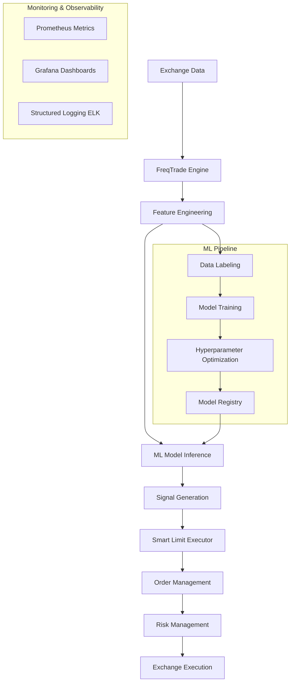

# 🚀 Stoic Citadel - Production-Grade MFT Algotrade Bot

<div align="center">


**A Production-Grade Mid-Frequency Trading Bot powered by XGBoost & Smart Execution**

[Quick Start](#-quick-start) • [Architecture](#-architecture) • [Features](#-features) • [Documentation](https://github.com/kandibobe/mft-algotrade-bot#readme)

</div>

## 📋 Overview

Stoic Citadel is a sophisticated algorithmic trading system designed for mid-frequency trading (MFT) across cryptocurrency markets. Built on top of FreqTrade with advanced machine learning capabilities, it combines traditional technical analysis with modern ML techniques for superior risk-adjusted returns.

### 🎯 Key Features

- **🤖 ML-Powered Signals**: XGBoost, LightGBM, and ensemble models for predictive trading
- **⚡ Smart Execution**: Intelligent limit order placement with dynamic slippage management
- **📊 Advanced Risk Management**: Circuit breakers, correlation monitoring, and position sizing
- **🔬 Feature Engineering**: 100+ technical indicators with automated feature selection
- **📈 Walk-Forward Optimization**: Robust out-of-sample validation framework
- **🐳 Production Ready**: Docker, Kubernetes, and comprehensive monitoring (Prometheus/Grafana)
- **🔒 Security First**: Built-in security scanning, secret management, and audit trails

## 🏗️ Architecture



## 🗺️ Roadmap

- [x] **Phase 1: Foundation (Done)**
  - [x] Basic Freqtrade integration
  - [x] Docker support
  - [x] Initial ML pipeline
- [x] **Phase 2: Advanced ML (Done)**
  - [x] XGBoost integration
  - [x] Stoic Ensemble Strategy V4 (Dynamic Thresholding)
  - [x] Feature Engineering Pipeline
- [ ] **Phase 3: Scaling & Reliability (In Progress)**
  - [ ] Kubernetes Helm charts
  - [ ] Multi-exchange arbitration
  - [ ] Advanced execution algorithms (TWAP/VWAP)

## 🚀 Quick Start

### Prerequisites
- Python 3.10+ or Docker
- Git
- (Optional) TA-Lib for technical indicators

### Installation

```bash
# 1. Clone the repository
git clone https://github.com/kandibobe/mft-algotrade-bot.git
cd mft-algotrade-bot

# 2. Install dependencies
make install

# 3. Configure your environment
cp .env.example .env
# Edit .env with your exchange API keys

# 4. Download historical data
python scripts/download_data.py --days 30

# 5. Run a backtest
make backtest
```

### Docker Quick Start

```bash
# Build and run with Docker Compose
docker-compose up --build

# Or run specific services
docker-compose -f docker-compose.monitoring.yml up
```

## 📁 Project Structure

```
mft-algotrade-bot/
├── src/                    # Source code (Python src-layout)
│   ├── config/            # Configuration management
│   ├── data/              # Data loading and preprocessing
│   ├── ml/                # Machine learning pipeline
│   ├── order_manager/     # Smart execution and order management
│   ├── risk/              # Risk management systems
│   ├── signals/           # Signal generation
│   ├── strategies/        # Trading strategies
│   ├── utils/             # Utilities and helpers
│   └── websocket/         # Real-time data streaming
├── tests/                 # Comprehensive test suite
├── scripts/               # Utility scripts
├── config/                # Configuration files
├── user_data/             # User data (gitignored)
├── monitoring/            # Prometheus/Grafana configs
├── docker/                # Docker configurations
├── docs/                  # Documentation
└── examples/              # Usage examples
```

## 🔧 Development

### Setup Development Environment

```bash
# Install development dependencies
make install-dev

# Run code quality checks
make lint

# Run tests
make test

# Format code
make format

# Run security scans
make security
```

### Available Make Commands

| Command | Description |
|---------|-------------|
| `make install` | Install production dependencies |
| `make install-dev` | Install all development dependencies |
| `make lint` | Run Ruff linter and type checking |
| `make format` | Format code with Black and isort |
| `make test` | Run test suite with coverage |
| `make security` | Run security scans (Bandit, Safety) |
| `make backtest` | Run a quick backtest |
| `make docker-up` | Start Docker services |
| `make clean` | Clean build artifacts and caches |

## 📊 Performance & Monitoring

The bot includes comprehensive monitoring:

- **Real-time Metrics**: Prometheus exporter for trading metrics
- **Dashboard**: Grafana dashboard for visualization
- **Health Checks**: Automated system health monitoring
- **Structured Logging**: ELK-compatible JSON logging
- **Alerting**: AlertManager integration for critical events

```bash
# Start monitoring stack
docker-compose -f docker-compose.monitoring.yml up

# Access dashboards:
# - Grafana: http://localhost:3000
# - Prometheus: http://localhost:9090
```

## 🤝 Contributing

We welcome contributions! Please see our [Contributing Guidelines](CONTRIBUTING.md) for details.

1. Fork the repository
2. Create a feature branch (`git checkout -b feature/amazing-feature`)
3. Commit your changes (`git commit -m 'Add amazing feature'`)
4. Push to the branch (`git push origin feature/amazing-feature`)
5. Open a Pull Request

### Development Standards
- Follow [PEP 8](https://peps.python.org/pep-0008/) style guide
- Use type hints for all function signatures
- Write comprehensive tests for new features
- Update documentation accordingly
- Run `make lint` and `make test` before submitting PRs

## 📚 Documentation

- [📖 Advanced Pipeline Guide](docs/ADVANCED_PIPELINE_GUIDE.md) - ML pipeline architecture
- [⚙️ Configuration Guide](docs/API_SETUP_RU.md) - API setup and configuration
- [🛡️ Risk Management](docs/ORDER_MANAGEMENT.md) - Order and risk management
- [🧪 Testing Guide](docs/TESTING_GUIDE.md) - Testing strategies and best practices
- [🐳 Deployment Guide](docs/deployment.md) - Production deployment

## ⚠️ Risk Disclaimer

**TRADING INVOLVES SUBSTANTIAL RISK OF LOSS**

This software is for educational and research purposes only. Past performance does not guarantee future results.

- **Not Financial Advice**: This bot is not financial advice. Use at your own risk.
- **Capital Risk**: You can lose all your invested capital.
- **Technical Risk**: Software bugs, exchange API failures, and network issues can cause losses.
- **Regulatory Risk**: Cryptocurrency regulations vary by jurisdiction and may change.

**NEVER TRADE WITH MONEY YOU CANNOT AFFORD TO LOSE.**

## 📄 License

This project is licensed under the MIT License - see the [LICENSE](LICENSE) file for details.

## 🙏 Acknowledgments

- [FreqTrade](https://www.freqtrade.io/) - The open-source trading framework
- [CCXT](https://github.com/ccxt/ccxt) - Crypto exchange trading library
- [XGBoost](https://xgboost.ai/) - Gradient boosting framework
- All contributors and testers of the Stoic Citadel project

---

<div align="center">

**Built with ❤️ by the Stoic Citadel Team**

[Report Bug](https://github.com/kandibobe/mft-algotrade-bot/issues) · [Request Feature](https://github.com/kandibobe/mft-algotrade-bot/issues)

</div>
