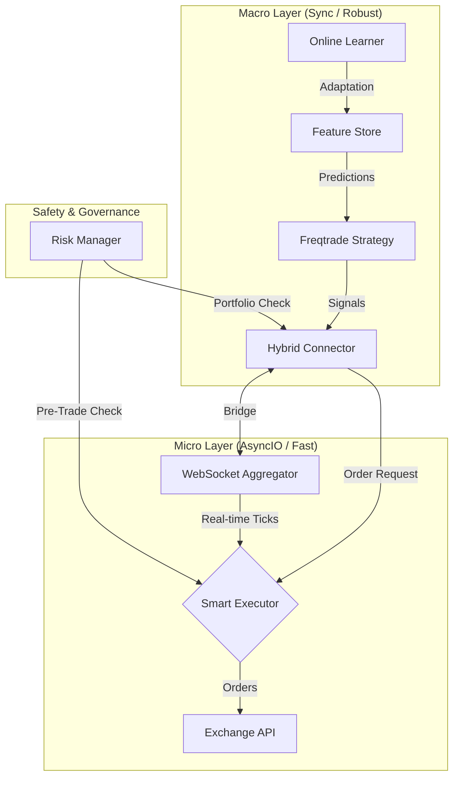

<div align="center">

```
   _____ _             _     _ _     _       _
  / ____| |           (_)   | (_)   | |     | |
 | (___ | |_ ___ _   _ _  __| |_  __| | __ _| |_
  \___ \| __/ _ \ | | | |/ _` | |/ _` |/ _` | __|
  ____) | ||  __/ |_| | | (_| | | (_| | (_| | |_
 |_____/ \__\___|\__,_|_|\__,_|_|\__,_|\__,_|\__|
```

**Institutional-Grade Hybrid MFT System (V7)**
*Engineered for Reliability, Speed, and Adaptive Intelligence.*

<p align="center">
  
  
  
  
  
  
</p>

[**Documentation**](docs/index.md) | [**Architecture**](docs/architecture/overview.md) | [**Report Bug**](https://github.com/kandibobe/mft-algotrade-bot/issues)

</div>

---

## **Introduction**

**Stoic Citadel V7** is a high-performance, hybrid trading framework designed to bridge the gap between retail algorithmic bots and institutional HFT systems. 

Unlike traditional bots that run on a single synchronous loop, Stoic Citadel employs a **Dual-Layer Architecture**:
1.  **Macro Layer (Strategy):** Uses Freqtrade & ML for robust trend analysis, regime detection, and signal generation.
2.  **Micro Layer (Execution):** Uses a custom `AsyncIO` engine for millisecond-latency order management, smart execution algorithms (Iceberg, Chase), and real-time risk checks.
3.  **Meta-Learning Layer:** Continuously adapts to market drift using online learning (River) and explainable AI (SHAP).

> **Status:** Institutional Grade (Prop Firm Ready)

> **🚀 Now featuring "Prop-Guardian" Risk Engine for FTMO/Funding Pips challenges.**

---

## **🚀 Quick Start**

Get up and running in less than 5 minutes.

**Prerequisites:** [Docker Desktop](https://www.docker.com/products/docker-desktop/) and [Git](https://git-scm.com/downloads).

```bash
# 1. Clone the repository
git clone https://github.com/kandibobe/mft-algotrade-bot.git
cd mft-algotrade-bot

# 2. Configure environment (Copy default settings)
# Windows (PowerShell):
copy .env.example .env
# Mac/Linux:
cp .env.example .env

# 3. Launch the system
docker-compose up -d --build
```

**Access Points:**
*   📊 **Dashboard:** [http://localhost:3000](http://localhost:3000)
*   ⚙️ **API:** [http://localhost:8080](http://localhost:8080)
*   🔐 **Credentials:** Default user is `stoic_admin`. See `.env` file for the generated password.

---

## **🌟 Key Differentiators**

### **1. Hybrid "Sync-Async" Core**
Most bots are slow because they process everything in one loop. Stoic Citadel decouples **Thinking** (Strategy) from **Acting** (Execution).
*   *Strategy* runs every 1m/5m/1h to find setups.
*   *Execution* runs in microseconds to fill orders at the best price.

### **2. Adaptive AI (V7)**
*   **Online Meta-Learning:** The system learns from its own execution outcomes in real-time.
*   **Explainability:** Every trade comes with a SHAP analysis explaining *why* it was taken.
*   **Feature Store:** Centralized management of alpha factors with offline/online consistency.

### **3. Institutional Risk Engine (Prop-Guardian)**
Designed to pass Prop Firm challenges (FTMO, Funding Pips) by strictly enforcing:
*   **Equity-Based Daily Drawdown:** Tracks real-time floating PnL to prevent soft-breaches.
*   **HRP (Hierarchical Risk Parity):** Mathematically optimal portfolio rebalancing.
*   **News Filter:** Automatically halts trading before High Impact events (Non-Farm Payrolls, FOMC).
*   **Circuit Breakers:** Multi-level stops for rapid market crashes.

### **4. Smart Execution Router (MFT)**
Never market buy blindly. The `SmartOrderExecutor` uses:
*   **ChaseLimit:** Places limit orders and updates them dynamically to avoid spread costs.
*   **Iceberg:** Splits large orders to hide intent.
*   **Pegged:** Floats orders relative to the spread.
*   **Multi-Backend:** Support for both Crypto (CCXT) and Forex/Indices (MetaTrader 5).

---

## **🏗 Architecture**

The system is built on a modular Event-Driven Architecture.



---

## **🛠 Development & Management**

The project includes a robust CLI for management.

**Requirements:** Python 3.10+, Docker.

### **Initial Setup (Dev)**
```bash
# Linux/macOS
make dev-install

# Windows (PowerShell)
.\manage.ps1 dev-install
```

### **Common Commands**

| Task | Command (Unix) | Command (Windows) | Description |
| :--- | :--- | :--- | :--- |
| **Run Tests** | `make test` | `.\manage.ps1 test` | Run unit tests |
| **Lint Code** | `make lint` | `.\manage.ps1 lint` | Check code quality |
| **Backtest** | `make backtest` | `.\manage.ps1 backtest` | Run strategy simulation |
| **Update Ops** | `make update` | `.\manage.ps1 update` | Pull latest updates |

---

## **📂 Project Structure**

*   `src/strategies/` - Hybrid Strategies & Connector Logic (Macro Layer).
*   `src/order_manager/` - Async Smart Execution Engine (Micro Layer).
*   `src/risk/` - **Prop-Guardian** Risk Engine (Equity Drawdown, HRP).
*   `src/ml/` - Feature Store, Online Learner & Model Registry.
*   `src/websocket/` - Real-time Data Streamers.
*   `deploy/` - Docker & Kubernetes configurations.

---

## **🤝 Contributing**

We welcome contributions from the community!
1.  Fork the Project
2.  Create your Feature Branch (`git checkout -b feature/AmazingFeature`)
3.  Commit your Changes (`git commit -m 'feat: Add some AmazingFeature'`)
4.  Push to the Branch (`git push origin feature/AmazingFeature`)
5.  Open a Pull Request

See [CONTRIBUTING.md](CONTRIBUTING.md) for detailed guidelines.

---

## **🛡 Security**

Security is paramount.
*   API Keys are managed via `.env` (never committed).
*   No external calls are made without explicit configuration.
*   See [SECURITY.md](SECURITY.md) for reporting vulnerabilities.

---

## **📜 License**

Distributed under the MIT License. See `LICENSE` for more information.

---

<div align="center">
  <sub>Built with ❤️ by the Stoic Citadel Team</sub>
</div>