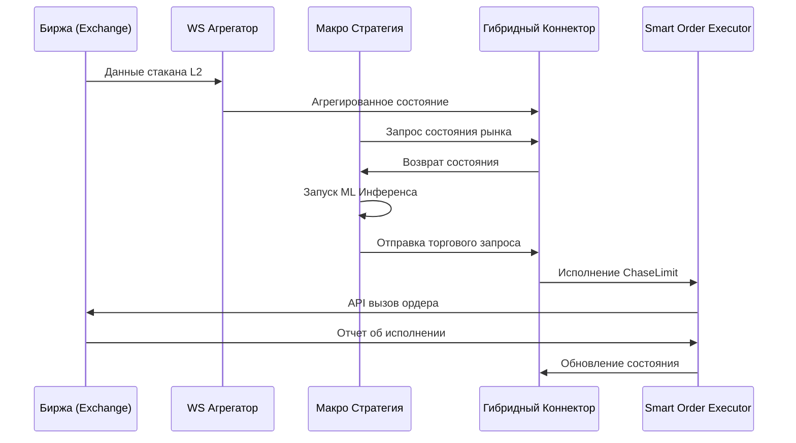

# 🏗️ Stoic Citadel: Руководство по Архитектуре

Этот документ представляет собой техническое погружение во внутреннее устройство Stoic Citadel, с фокусом на гибридную архитектуру и ключевые компоненты системы.

## 1. Философия Гибридного Разделения (Decoupled Execution)

Stoic Citadel построен на принципе **Разделенного Исполнения (Decoupled Execution)**. Мы отделяем процесс принятия решений (Макро-уровень) от логики исполнения ордеров (Микро-уровень), чтобы достичь одновременно интеллектуальной гибкости и высокой скорости.

### Макро-уровень (Интеллект)
*   **Роль:** Генерация долгосрочной альфы, определение рыночного режима и оптимизация портфеля.
*   **Компоненты:** Стратегия Freqtrade, Мета-обучение (Ensemble), Аллокатор HRP.
*   **Данные:** Свечи OHLCV (5m, 1h), Хранилище Признаков (Feature Store - Redis/Parquet).
*   **Латентность (Задержка):** Секунды (Блокирующий/Синхронный код).

### Микро-уровень (Исполнение)
*   **Роль:** Управление ордерами в реальном времени, минимизация проскальзывания (slippage) и защитные шлюзы.
*   **Компоненты:** Websocket Агрегатор, Smart Order Executor, Circuit Breakers (Автоматические выключатели).
*   **Данные:** Стакан L2 (Orderbook), Тики, Сделки.
*   **Латентность (Задержка):** <100мс (Асинхронный/Неблокирующий код).

---

## 2. Гибридный Коннектор (The Hybrid Connector)

Модуль `src/strategies/hybrid_connector.py` выступает в роли моста между двумя уровнями. Он предоставляет потокобезопасный интерфейс для Макро-стратегии, позволяя:
1.  Запрашивать рыночные данные в реальном времени (спред, ликвидность).
2.  Отправлять запросы на исполнение в Микро-уровень.
3.  Получать обновления статусов и отчеты об исполнении.

---

## 3. Движок Исполнения Ордеров (Order Execution Engine)

Наш `SmartOrderExecutor` реализует алгоритмы исполнения институционального уровня:

### Логика ChaseLimit
Вместо статичных лимитных ордеров, `ChaseLimit` динамически корректирует цену ордера на основе лучших цен bid/ask и глубины стакана. Это обеспечивает высокую вероятность исполнения (fill rate) без уплаты спреда, характерного для рыночных ордеров.

### Разбиение TWAP/VWAP
Крупные ордера автоматически разбиваются на более мелкие части (Child Orders) и исполняются в течение времени или по объему, чтобы минимизировать влияние на рынок и обнаружить скрытую ликвидность.

---

## 4. Ядро Риск-менеджмента и Безопасность

Каждая транзакция обязана пройти через **Шлюз Риска (Risk Gate)** (`src/risk/risk_manager.py`):

*   **Circuit Breakers (Авто-выключатели):** Мониторит общесистемные метрики (просадка, задержки сети, здоровье API).
*   **Де-рискинг Корреляции:** Предотвращает чрезмерную концентрацию в сильно коррелированных активах, используя модуль HRP.
*   **Размер Позиции:** Динамический расчет размера позиции на основе волатильности (Критерий Келли или веса HRP).

---

## 5. MLOps и Инжиниринг Признаков

ML-пайплайн спроектирован для надежности и низкой задержки инференса:

*   **Feature Store:** Единый доступ к историческим и real-time признакам.
*   **Meta-Learning:** Вторичная модель предсказывает уверенность первичных моделей, позволяя системе снижать риски в "ненадежных" рыночных режимах.
*   **Time-Series CV:** Продвинутая кросс-валидация для предотвращения утечки данных (data leakage) и обеспечения надежности на новых данных (out-of-sample).

---

## 6. Диаграмма Потоков Данных

