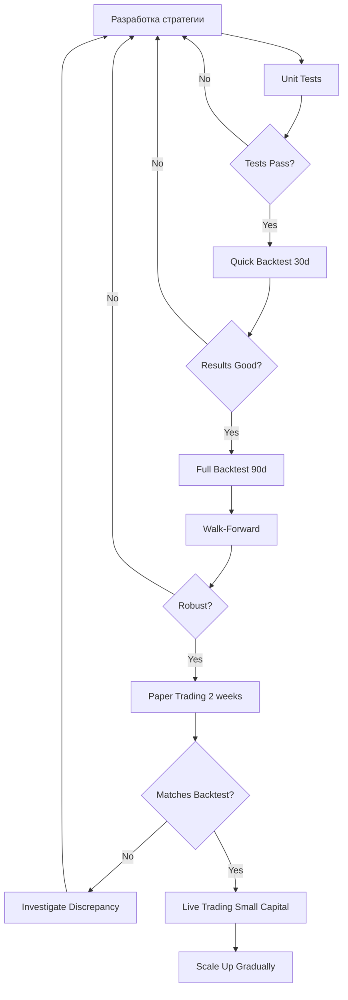

# 🧪 Comprehensive Testing Guide

## Содержание
1. [Философия тестирования](#философия-тестирования)
2. [Локальное тестирование](#локальное-тестирование)
3. [Бэктестинг стратегий](#бэктестинг-стратегий)
4. [Walk-Forward валидация](#walk-forward-валидация)
5. [Paper Trading (Dry-run)](#paper-trading-dry-run)
6. [Стресс-тестирование](#стресс-тестирование)
7. [Диагностика проблем](#диагностика-проблем)

---

## Философия тестирования

### Пирамида тестирования

```
                    /\
                   /  \
                  / Live \
                 /________\
                /          \
               /  Paper     \
              /    Trading   \
             /______________\
            /                \
           /    Backtesting   \
          /____________________\
         /                      \
        /      Unit Tests        \
       /__________________________\
```

**Правило**: 70% юнит-тестов, 20% бэктестов, 10% paper trading

---

## Локальное тестирование

### 1. Unit Tests (Тесты модулей)

#### Запуск всех тестов:
```bash
# Полный прогон
make test

# Только юнит-тесты
make test-unit

# С покрытием кода
make test-coverage
```

#### Запуск конкретных тестов:
```bash
# Тестирование индикаторов
pytest tests/test_strategies/test_indicators.py -v

# Тестирование конкретной стратегии
pytest tests/test_strategies/test_stoic_ensemble.py -v

# Тестирование shared library
pytest tests/test_signals/ -v
```

#### Создание своих тестов:

**Пример теста для новой стратегии**:
```python
# tests/test_strategies/test_my_strategy.py

import pytest
from my_strategy import MyStrategy

def test_strategy_initialization():
    """Тест инициализации стратегии."""
    strategy = MyStrategy()
    assert strategy.timeframe == '5m'
    assert strategy.stoploss == -0.05

def test_entry_signals(uptrend_dataframe, strategy_metadata):
    """Тест генерации сигналов входа."""
    strategy = MyStrategy()

    # Расчет индикаторов
    df = strategy.populate_indicators(
        uptrend_dataframe.copy(),
        strategy_metadata
    )

    # Генерация сигналов
    df = strategy.populate_entry_trend(df, strategy_metadata)

    # Проверка
    assert 'enter_long' in df.columns
    assert df['enter_long'].sum() > 0  # Должны быть сигналы

def test_risk_parameters():
    """Тест соблюдения риск-параметров."""
    strategy = MyStrategy()

    # Критические параметры
    assert strategy.stoploss == -0.05, "Stoploss должен быть -5%"
    assert strategy.trailing_stop is True
    assert len(strategy.protections) > 0
```

---

## Бэктестинг стратегий

### Быстрый бэктест (разработка)

```bash
# Бэктест на 30 днях
make backtest STRATEGY=StoicCitadelV2 TIMERANGE=20240101-20240130

# Альтернатива через Docker
docker-compose run --rm freqtrade backtesting \
  --strategy StoicCitadelV2 \
  --timerange 20240101-20240130 \
  --timeframe 5m
```

### Полный бэктест (перед продом)

```bash
# Бэктест на 90+ днях с максимальной детализацией
docker-compose run --rm freqtrade backtesting \
  --strategy StoicCitadelV2 \
  --timerange 20240101- \
  --timeframe 5m \
  --enable-protections \
  --export trades \
  --export-filename user_data/backtest_results/my_strategy_full.json
```

### Анализ результатов

#### Ключевые метрики:

```bash
# Просмотр отчета
docker-compose run --rm freqtrade backtesting-show
```

**Минимальные требования для перехода к paper trading**:
- ✅ **Win rate**: > 50%
- ✅ **Profit Factor**: > 1.5
- ✅ **Sharpe Ratio**: > 0.5
- ✅ **Max Drawdown**: < 15%
- ✅ **Total trades**: > 100 (для статистической значимости)
- ✅ **Avg trade duration**: Соответствует вашему стилю

**Красные флаги** 🚩:
- Win rate > 80% (вероятно overfitting)
- Max drawdown > 20% (слишком рискованно)
- < 50 сделок (недостаточно данных)

---

## Walk-Forward валидация

Walk-forward - это "честный" бэктест, предотвращающий overfitting.

### Концепция:

```
Dataset: [=====================================]
         [Train]---[Test]
                [Train]---[Test]
                       [Train]---[Test]
                              [Train]---[Test]
```

### Запуск:

```bash
# Скрипт для walk-forward
python scripts/walk_forward.py \
  --strategy StoicCitadelV2 \
  --timerange 20240101-20240630 \
  --train-period 60 \
  --test-period 15
```

**Параметры**:
- `train-period`: Период обучения (дни)
- `test-period`: Период тестирования (дни)
- Окно "скользит" через весь датасет

**Интерпретация**:
- Если результаты **стабильны** на всех окнах → стратегия робастна
- Если сильный **разброс** → overfitting

---

## Paper Trading (Dry-run)

### Запуск сухого прогона:

```bash
# Запуск с конфигом dry-run
make trade-dry

# Альтернатива
docker-compose up -d freqtrade frequi
```

### Мониторинг:

```bash
# Логи в реальном времени
make logs SERVICE=freqtrade

# Dashboard
open http://localhost:3000
```

### Чеклист перед live:

**Минимум 2 недели paper trading**:

- [ ] Стратегия совершила > 50 сделок
- [ ] Win rate соответствует бэктесту (±5%)
- [ ] Max drawdown соответствует бэктесту (±3%)
- [ ] Нет критических ошибок в логах
- [ ] API подключение стабильно
- [ ] Telegram уведомления работают
- [ ] Все ордера заполняются корректно
- [ ] Stoploss срабатывают правильно

**Сравнение с бэктестом**:

| Метрика | Бэктест | Paper Trading | Допустимое отклонение |
|---------|---------|---------------|------------------------|
| Win Rate | 55% | 52% | ±5% ✅ |
| Profit Factor | 1.8 | 1.6 | ±20% ✅ |
| Max DD | 8% | 12% | ±5% ⚠️ |

---

## Стресс-тестирование

### 1. Тест волатильности

Запустите бэктест на периодах высокой волатильности:

```bash
# Тест на обвале марта 2020
docker-compose run --rm freqtrade backtesting \
  --strategy StoicCitadelV2 \
  --timerange 20200301-20200331

# Тест на росте 2021
docker-compose run --rm freqtrade backtesting \
  --strategy StoicCitadelV2 \
  --timerange 20210101-20210228
```

**Ожидание**: Max drawdown не должен превышать 15%

### 2. Тест корреляции

Проверьте, как стратегия ведет себя при высокой корреляции активов:

```python
# scripts/test_correlation.py

from src.risk.correlation import CorrelationManager

manager = CorrelationManager()

# Симуляция портфеля с 3 коррелированными позициями
positions = [
    {'pair': 'BTC/USDT'},
    {'pair': 'ETH/USDT'},
    {'pair': 'BNB/USDT'}
]

# Проверка блокировки новой позиции
allowed = manager.check_entry_correlation(
    new_pair='SOL/USDT',
    new_pair_data=sol_data,
    open_positions=positions,
    all_pairs_data=all_data
)

assert allowed == False, "Должна блокировать при высокой корреляции"
```

### 3. Тест API лимитов

Убедитесь, что стратегия не превышает лимиты биржи:

```bash
# Запустите с агрессивными параметрами
docker-compose run --rm freqtrade backtesting \
  --strategy StoicCitadelV2 \
  --timerange 20240101-20240107 \
  --max-open-trades 10  # Больше обычного
```

**Проверьте логи на**:
- ❌ Rate limit errors
- ❌ API timeout errors
- ❌ Order rejection errors

---

## Диагностика проблем

### Проблема: Стратегия не открывает сделки

**Чеклист**:

```bash
# 1. Проверьте, что индикаторы рассчитываются
docker-compose run --rm freqtrade backtesting \
  --strategy StoicCitadelV2 \
  --timerange 20240101-20240107 \
  --export trades \
  --export-filename test.json

# 2. Проверьте наличие данных
ls -lh user_data/data/binance/

# 3. Проверьте логи
docker-compose logs freqtrade | grep ERROR

# 4. Проверьте whitelist
docker-compose run --rm freqtrade list-pairs
```

### Проблема: Win rate в live ниже бэктеста

**Возможные причины**:

1. **Lookahead bias** (используются будущие данные)
   - Проверьте `process_only_new_candles = True`
   - Используйте shared library для parity

2. **Slippage** (проскальзывание цены)
   - Добавьте комиссию в бэктест: `--fee 0.001`
   - Используйте `order_book_top` вместо `last_price`

3. **Market conditions changed** (рынок изменился)
   - Запустите бэктест на последних 30 днях
   - Сравните с paper trading

### Проблема: Стратегия не проходит тесты

```bash
# Запустите конкретный тест с подробностями
pytest tests/test_strategies/test_my_strategy.py::test_entry_signals -vv

# Проверьте покрытие
pytest tests/ --cov=user_data/strategies --cov-report=html
open htmlcov/index.html
```

---

## Best Practices

### ✅ DO:

1. **Тестируйте на разных периодах**:
   - Bull market (рост)
   - Bear market (падение)
   - Sideways (флэт)

2. **Используйте реалистичные параметры**:
   ```json
   {
     "stake_amount": "unlimited",
     "tradable_balance_ratio": 0.99,
     "dry_run_wallet": 1000  // Реальная сумма
   }
   ```

3. **Записывайте результаты**:
   ```bash
   # Создайте журнал тестирования
   echo "2024-01-15 | StoicV2 | Backtest 90d | WR: 55% | PF: 1.8" >> tests/test_log.txt
   ```

### ❌ DON'T:

1. **Не оптимизируйте на одном датасете**
   - Overfitting гарантирован

2. **Не игнорируйте комиссии**
   - Они "съедают" 20-30% профита

3. **Не пропускайте paper trading**
   - "Бэктест отличный" ≠ "Live profitable"

---

## Инструменты

### Полезные команды:

```bash
# Экспорт результатов в CSV
docker-compose run --rm freqtrade backtesting-analysis \
  --export-filename user_data/backtest_results/analysis.json

# Генерация отчета
docker-compose run --rm freqtrade plot-dataframe \
  --strategy StoicCitadelV2 \
  --pairs BTC/USDT \
  --indicators1 ema_50,ema_200 \
  --indicators2 rsi

# Проверка конфигурации
docker-compose run --rm freqtrade show-config
```

---

## Итоговый Workflow



---

## Контрольный список

Перед переходом на live:

- [ ] Unit tests: 100% pass
- [ ] Backtest 90d: Win rate > 50%, PF > 1.5
- [ ] Walk-forward: Стабильные результаты
- [ ] Paper trading: 2+ недели, > 50 сделок
- [ ] Paper vs Backtest: отклонение < 10%
- [ ] Логи: нет ERROR
- [ ] Telegram: работает
- [ ] Stoploss: срабатывает корректно
- [ ] Risk management: correlation check активен
- [ ] Circuit breaker: протестирован
- [ ] Database: PostgreSQL подключен
- [ ] Monitoring: Grafana настроен
- [ ] Документация: обновлена

---

**Помните**: "Лучше потратить 2 недели на тестирование, чем потерять деньги за 1 день."

🏛️ **Stoic Citadel** - Test thoroughly, trade confidently.
