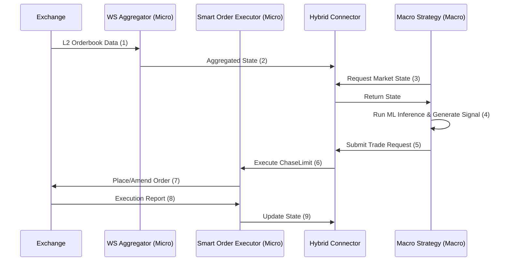

# System Architecture

This document provides a technical deep-dive into the internal workings of Stoic Citadel, focusing on the hybrid architecture and core system components.

## 1. Hybrid Decoupling Philosophy

Stoic Citadel is built on the principle of **Decoupled Execution**. We separate the decision-making process (Macro) from the execution logic (Micro) to achieve both intelligence and speed.

!!! info "Why Hybrid?"
    A hybrid architecture allows us to use the best tool for the job. The Macro layer can perform complex, blocking calculations without impacting the Micro layer's ability to react to market changes in milliseconds.

### Macro Layer (Intelligence)
- **Role:** Long-term alpha generation, regime detection, and portfolio optimization.
- **Components:** Freqtrade Strategy, Meta-Learning Ensemble, HRP Allocator.
- **Data:** OHLCV (5m, 1h), Feature Store (Redis/Parquet).
- **Latency:** Seconds (Blocking/Synchronous).

### Micro Layer (Execution)
- **Role:** Real-time order management, slippage minimization, and safety gating.
- **Components:** Websocket Aggregator, Smart Order Executor, Circuit Breakers.
- **Data:** L2 Orderbook, Tickers, Trades.
- **Latency:** <100ms (Asynchronous/Non-blocking).

## 2. The Hybrid Connector

The `src/strategies/hybrid_connector.py` acts as the bridge between the two layers. It provides a thread-safe interface for the Macro Strategy to:
1.  Query real-time market data (spread, liquidity).
2.  Submit execution requests to the Micro Layer.
3.  Receive status updates and execution reports.

## 3. Order Execution Engine

Our `SmartOrderExecutor` implements institutional-grade execution algorithms.

### ChaseLimit Logic
Instead of a static limit order, `ChaseLimit` dynamically adjusts the order price based on the best bid/ask and orderbook depth. This ensures high fill rates without paying the spread of a market order.

!!! tip "Maker Fees"
    By staying at the top of the orderbook, `ChaseLimit` orders are more likely to be filled as "maker" orders, often resulting in a rebate from the exchange.

## 4. Risk Core & Safety

Every transaction must pass through the **Risk Gate** (`src/risk/risk_manager.py`).

- **Circuit Breakers:** Monitors system-wide metrics (drawdown, latency, API health).
- **Position Sizing:** Volatility-adjusted sizing based on the Kelly Criterion or HRP weights.

## 5. Data Flow Diagram

1.  The **WebSocket Aggregator** streams real-time L2 order book data from the exchange.
2.  This data is processed into an aggregated state (e.g., current spread, depth).
3.  The **Macro Strategy** can query this state via the **Hybrid Connector**.
4.  The strategy's ML models generate a trading signal.
5.  The signal is sent as a trade request to the **Hybrid Connector**.
6.  The request is forwarded to the **Smart Order Executor**.
7.  The **SOE** places an order on the exchange using `ChaseLimit` logic.
8.  The exchange confirms the order execution.
9.  The final state is reported back to the system.
